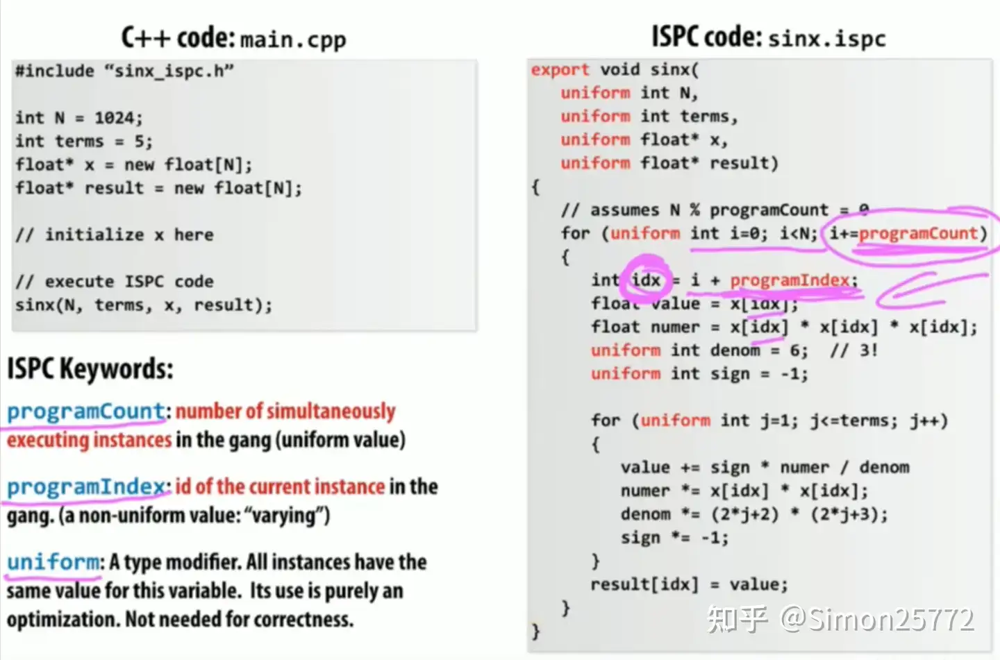

# ISPC 语言的关键概念

ISPC 提供了一些特殊的关键字来处理并行计算：  

1.`programCount`：
* 它代表当前并行执行的**​实例总数​**​;
* 这个值​​**不由你直接指定​**，它是由硬件决定的，通常是底层 SIMD 处理器宽度（比如 4, 8, 16）的倍数。程序运行时会自动确定;
* 简单理解： 想象你有一把叉子（ SIMD ），叉子有 N 个齿，一次可以叉起 N 块食物（数据）同时处理。programCount 就相当于一次操作能处理的“食物块”总数，这个数字跟你的叉子大小有关。  

2.`programIndex`：
* 它代表 **​当前正在执行的实例 在总实例 programCount 中的索引​​**；
* 范围是 0 到 programCount - 1；
* 简单理解： 就像给叉子上的每一个齿（处理单元）编个号（0, 1, 2, ...）。programIndex 告诉你当前是哪个齿在工作。

3.`uniform`：
* 这是一个给​​**编译器看的优化提示**​​。
* 当你声明一个变量为 uniform 时，是告诉编译器：​**​这个变量在所有并行执行的实例中，值都一模一样​**​。
* 为什么有用？ 编译器知道这个值不需要为每个实例单独存储或计算一次。它可以只计算一次，然后广播给所有实例使用，或者进行其他优化，从而显著提高效率。笔记里课件中一些变量加了 uniform 前缀，就是为了利用这个优化。
